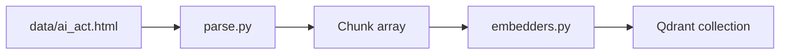
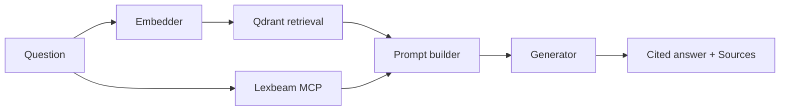
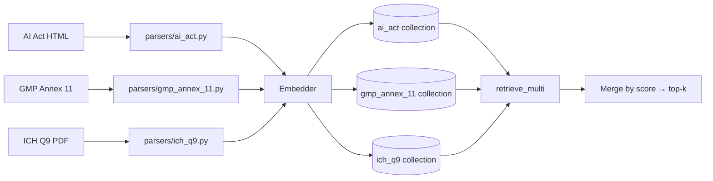

# EU AI Act RAG Demo

A minimal RAG demo over the EU Artificial Intelligence Act (Regulation (EU) 2024/1689) for pharma IT, regulatory affairs, and compliance teams. Every answer cites the specific article or annex point it draws from. Swap between local and cloud embedders and generators at runtime.

Each query combines two sources:
- **Semantic retrieval** from a local Qdrant index over the full AI Act text (auditable, citable)
- **Deterministic structured lookup** via the [lexbeam EU AI Act MCP](https://github.com/lexbeam-software/eu-ai-act-mcp) (risk classification, deadlines, obligations)

---

## Screenshots


---

## Prerequisites

- **Python 3.11+** and [`uv`](https://docs.astral.sh/uv/) — `uv` manages the Python version automatically.
  ```bash
  curl -LsSf https://astral.sh/uv/install.sh | sh  # macOS/Linux
  winget install astral-sh.uv                       # Windows
  ```
  Or download from [astral.sh/uv](https://astral.sh/uv).

- **Node.js 18+** — required to run the lexbeam MCP server, which the app launches via `npx`.
  ```bash
  brew install node        # macOS
  winget install OpenJS.NodeJS  # Windows
  sudo apt install nodejs       # Linux
  ```
  Or download from [nodejs.org](https://nodejs.org).

- **Ollama** (only needed for local generation — the default):
  ```bash
  brew install ollama                        # macOS
  winget install Ollama.Ollama               # Windows
  curl -fsSL https://ollama.com/install.sh | sh  # Linux
  ```
  Or download from [ollama.com](https://ollama.com). Then pull a model:
  ```bash
  ollama pull gemma2:9b       # default (~5GB)
  ollama pull gemma4:e4b      # better instruction following (~10GB)
  ```

---

## Setup

```bash
uv sync                     # creates .venv and installs all dependencies
cp .env.example .env        # add API keys only for the providers in use
```

### Optional: API keys

The defaults are fully local — no keys required. Add keys to `.env` only when using cloud providers:

| Key | Provider | When needed |
|-----|----------|-------------|
| `ANTHROPIC_API_KEY` | Claude Sonnet (Anthropic) | Generator: `claude-sonnet` |
| `GEMINI_API_KEY` | Gemini + Gemini Embedding (Google) | Generator: `gemini-2.0-flash-lite` or Embedder: `gemini-embedding` |
| `VOYAGE_API_KEY` | Voyage embeddings | Embedder: `voyage-lite` |

---

## Downloading the AI Act HTML

EUR-Lex blocks automated downloads — this is a known limitation and the only manual step in the setup. Download the file manually:

1. Open in your browser: <https://eur-lex.europa.eu/legal-content/EN/TXT/HTML/?uri=OJ:L_202401689>
2. Wait for the full page to load (you should see Article 1, Article 2… scrolling down)
3. **Right-click → Save Page As → Webpage, HTML Only**
4. Save as `data/ai_act.html` in the project root

---

## Run

```bash
uv run python -m src.ingest       # parse HTML → embed → write Qdrant (~30 s on first run)
uv run streamlit run app.py
```

The UI opens at http://localhost:8501. Re-indexing is only needed when you switch embedders — each embedder writes to its own Qdrant collection. You can also trigger it from the sidebar.

---

## Usage notes

- **Fully local by default.** `local-bge-m3` + `ollama-gemma2` run entirely on the machine. No data leaves, no API keys required.
- **Generator recommendation.** `ollama-gemma4` (gemma4:e4b) follows the system prompt more reliably than `ollama-gemma2` on nuanced compliance questions. Requires ~10GB free disk space.
- **Sensitive data toggle.** Hides cloud generators (Gemini, Claude) and restricts to local models only. Use this when working with patient data or unpublished trial data — no prompts leave the machine.
- **Sources panel.** Every answer shows retrieved article excerpts with scores plus the lexbeam structured output. This is the most important UI element — every claim is traceable to the primary source.
- **Off-topic refusal.** If the top retrieval score is below 0.55, the app stops before generation and surfaces a warning. Prevents the model from hallucinating answers to unrelated questions.
- **This is informational tooling, not legal advice.** Every answer ends with this disclaimer.

---

## Architecture

Each query runs two parallel lookups before generation:

1. **lexbeam MCP** (`npx`, stdio) — deterministic structured lookup: risk classification, applicable obligations, phased deadlines.
2. **Qdrant** (embedded, file-backed, no Docker) — top-5 chunks by semantic similarity over the full AI Act text. Dense vector search only; Qdrant supports hybrid BM25+dense fusion but it's out of scope here.

Both outputs are injected into the prompt. The generator (local or cloud) produces a cited answer; the UI surfaces the raw sources alongside it so every claim can be verified against the primary text.

**Indexing pipeline** (run once, or when switching embedders):



**Query pipeline** (every question):



**Module map:**

| File | Role |
|------|------|
| `src/config.py` | Paths, API keys, runtime defaults |
| `src/parse.py` | EUR-Lex HTML → `Chunk[]` (one per article, one per Annex III point) |
| `src/ingest.py` | Parse → embed → upsert to Qdrant |
| `src/embedders.py` | All embedder classes and registry |
| `src/retrieve.py` | Embed query → Qdrant search → ranked chunks |
| `src/lex_client.py` | Sync wrapper around the lexbeam MCP stdio server |
| `src/generators.py` | All generator classes and registry |
| `src/prompts.py` | System prompt (citation contract, pharma framing) + user prompt builder |

For the full architecture analysis — including pharma regulatory constraints, deployment topology options, and the layered evolution path from demo to production — see [docs/ARCHITECTURE.md](docs/ARCHITECTURE.md).

---


## Developing further: adding pharma regulatory frameworks

Pharma operates under GMP Annex 11, ICH Q9, MDR, IVDR, and GAMP 5 — frameworks that already govern most of what the AI Act now formalises. A production tool needs to answer against both, so a regulatory affairs team gets a single cited response they can put in front of an inspector.

There are two architectural paths for this. They're not mutually exclusive; the right choice per framework depends on what's available.

### Path A — extend the Qdrant corpus

Index each framework as a new Qdrant collection alongside `ai_act__*`. Parse the source document into chunks, embed with each registered embedder, and extend `retrieve.py` to query all collections and merge results by score.

| Framework | Format | Availability | Notes |
|-----------|--------|-------------|-------|
| GMP Annex 11 (Computerised Systems) | HTML | Free — EudraLex Vol. 4 | Directly maps to AI Act Art. 9/17 — highest leverage |
| ICH Q9 (Quality Risk Management) | PDF | Free — ich.org | Mirrors AI Act risk management structure |
| MDR 2017/745 key articles | HTML | Free — EUR-Lex (same WAF block as AI Act, manual download) | Relevant for medical device AI |
| IVDR 2017/746 key articles | HTML | Free — EUR-Lex | Relevant for diagnostic AI |
| GAMP 5 (2nd ed.) | PDF | ISPE members only, cannot redistribute | Skip for any open demo |

The shape of the extension:



Each framework adds one parser file under `src/parsers/` and one Qdrant collection. `ingest.py` maps a `--corpus` flag to the right parser. `retrieve_multi` queries all collections and merges by score.

The system prompt gains one rule: cite the framework alongside the clause (e.g. `[GMP Annex 11, clause 4.2]`) and draw cross-framework connections when the same obligation appears in multiple sources.

**When to use:** the document is open or licensed for indexing and full clause text is required in the answer for auditability.

### Path B — add another MCP

If a deterministic MCP exists for a framework (the way `lexbeam-software/eu-ai-act-mcp` does for the AI Act), wire it in the same way as `src/lex_client.py`: a thin sync wrapper, called between retrieval and generation, output formatted into the prompt.

No parser, no chunking, no re-indexing — but the output is limited to what the MCP exposes: classifications, deadlines, structured summaries. No GMP Annex 11 or ICH Q9 MCP exists yet; when one does, wiring it in is a thin wrapper. A custom MCP server over a Qdrant collection is also an option to get both.

**When to use:** a maintained MCP exists for the framework and structured output is sufficient — full clause text is not needed in the answer.

### What this enables

Cross-framework questions — "how does AI Act Article 9 map to ICH Q9 risk management?" — become answerable with cited text from both sources. That's the bar for a regulatory affairs team preparing for an inspection.

---

## Fallback if `uv` is not available

On corporate-locked machines:

```bash
uv export --format requirements-txt > requirements.txt
python -m venv .venv && source .venv/bin/activate
pip install -r requirements.txt
```
