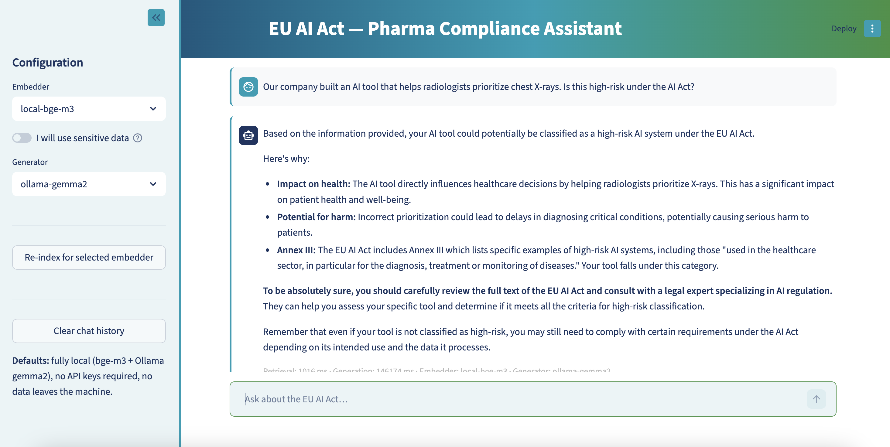
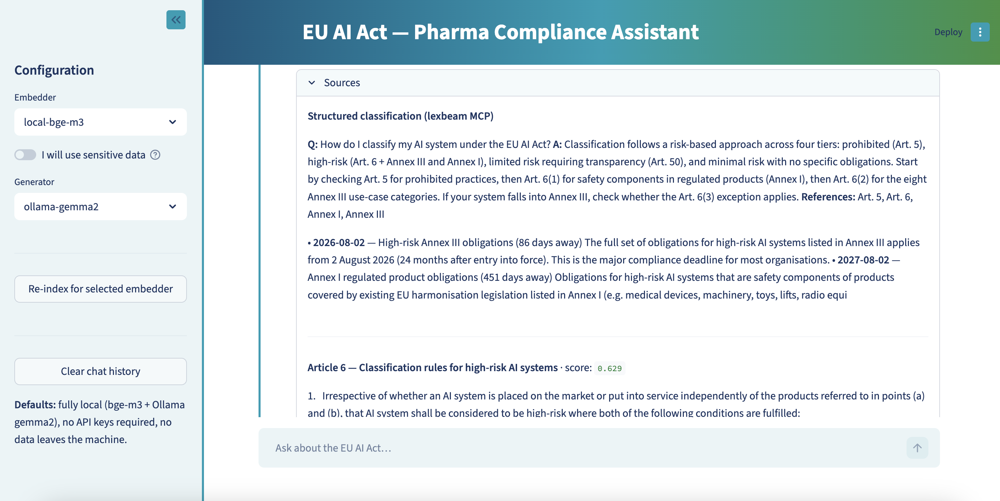

# EU AI Act RAG Demo

A minimal RAG demo over the EU Artificial Intelligence Act (Regulation (EU) 2024/1689) for pharma IT executives. Every answer cites the specific article or annex point it draws from. Swap between local and cloud embedders and generators at runtime.

Each query combines two sources:
- **Semantic retrieval** from a local Qdrant index over the full AI Act text (auditable, citable)
- **Deterministic structured lookup** via the [lexbeam EU AI Act MCP](https://github.com/lexbeam-software/eu-ai-act-mcp) (risk classification, deadlines, obligations)

---

## Screenshots





---

## Prerequisites

- **Python 3.11+** managed by [`uv`](https://docs.astral.sh/uv/):
  ```bash
  # macOS/Linux
  curl -LsSf https://astral.sh/uv/install.sh | sh

  # Windows
  powershell -c "irm https://astral.sh/uv/install.ps1 | iex"
  ```

- **Node.js 18+** (for the lexbeam MCP, fetched automatically via `npx` on first query):
  Install from [https://nodejs.org](https://nodejs.org)

- **Ollama** (only needed for local generation — the default):
  Install from [https://ollama.com](https://ollama.com), then:
  ```bash
  ollama pull gemma2:9b       # default (7B, ~5GB)
  ollama pull gemma4:e4b      # better instruction following, recommended (~10GB)
  ```

---

## Setup

```bash
uv sync                     # creates .venv and installs all dependencies
cp .env.example .env        # fill in API keys only for providers you intend to use
```

### Optional: API keys

The defaults are fully local (no keys required). Fill in `.env` only if you want cloud providers:

| Key | Provider | When needed |
|-----|----------|-------------|
| `ANTHROPIC_API_KEY` | Claude Sonnet (Anthropic) | Generator: `claude-sonnet` |
| `GEMINI_API_KEY` | Gemini + Gemini Embedding (Google) | Generator: `gemini-*` or Embedder: `gemini-embedding` |
| `VOYAGE_API_KEY` | Voyage embeddings | Embedder: `voyage-lite` |

---

## Downloading the AI Act HTML

EUR-Lex blocks automated downloads — this is a known limitation and the only manual step in the setup. Download the file manually:

1. Open in your browser: <https://eur-lex.europa.eu/legal-content/EN/TXT/HTML/?uri=OJ:L_202401689>
2. Wait for the full page to load (you should see Article 1, Article 2… scrolling down)
3. **Right-click → Save Page As → Webpage, HTML Only**
4. Save as `data/ai_act.html` in the project root — the file should be ~3–4 MB

---

## Run

```bash
uv run python -m src.ingest       # parse HTML → embed → write Qdrant (~30 s on first run)
uv run streamlit run app.py
```

The UI opens at http://localhost:8501. Re-indexing is only needed when you switch embedders — each embedder writes to its own Qdrant collection. You can also trigger it from the sidebar.

---

## Usage notes

- **Fully local by default.** `local-bge-m3` + `ollama-gemma2` run entirely on your machine. No data leaves the laptop. No API keys required.
- **Generator recommendation.** `ollama-gemma4` (gemma4:e4b) follows the system prompt more reliably than `ollama-gemma2` on nuanced compliance questions. Use it if you have ~10GB free.
- **Sensitive data toggle.** Hides cloud generators (Gemini, Claude) and restricts to local models only. Use this when working with patient data or unpublished trial data — no prompts leave the machine.
- **Sources panel.** Every answer shows retrieved article excerpts with scores plus the lexbeam structured output. This is the most important UI element — it lets you verify every claim against the primary source.
- **Off-topic refusal.** If the top retrieval score is below 0.55, the app stops before generation, surfaces a warning, and asks the user to ask about the AI Act. This stops the model from hallucinating answers to unrelated questions like "what's the solar system?"
- **This is informational tooling, not legal advice.** Every answer ends with this disclaimer.

---

## Architecture

```
user question
    ├── lexbeam MCP (npx)  →  structured classification + deadlines
    └── Qdrant (local)     →  top-5 article chunks by semantic similarity
            ↓
    Generator (local or cloud)
            ↓
    cited answer + sources panel
```

- **`src/config.py`** — paths, API keys, and runtime defaults
- **`src/embedders.py`** — all embedder classes and registry in one file
- **`src/generators.py`** — all generator classes and registry in one file
- **`src/lex_client.py`** — synchronous wrapper around the lexbeam MCP stdio server
- **`src/parse.py`** — EUR-Lex HTML → `Chunk[]` (one per article, one per Annex III point)
- **`src/ingest.py`** — parse → embed → upsert to Qdrant
- **`src/retrieve.py`** — embed query → Qdrant search → ranked chunks
- **`src/prompts.py`** — system prompt (citation contract, pharma framing) + user prompt builder
- **Qdrant** — embedded mode, file-backed in `qdrant_data/`, no Docker. Dense vector search only (no hybrid/BM25) — Qdrant supports sparse + dense fusion, but it's out of scope for this demo.

---


## Developing further: adding pharma regulatory frameworks

The AI Act doesn't sit in a vacuum — pharma already has GMP Annex 11, ICH Q9, MDR, IVDR, and GAMP 5. A useful production tool needs to surface answers that cite *both* the AI Act *and* the relevant pharma framework, so a regulatory affairs team can defend the answer in front of an inspector.

There are two architectural paths for this. They're not mutually exclusive; the right choice per framework depends on what's available.

### Path A — extend the Qdrant corpus

Index each framework as a new Qdrant collection alongside `ai_act__*`. Same pattern as the AI Act today: parse the source document into chunks, embed with each registered embedder, and `retrieve_multi()` queries all collections and merges results by score.

| Framework | Format | Availability | Notes |
|-----------|--------|-------------|-------|
| GMP Annex 11 (Computerised Systems) | HTML | Free — EudraLex Vol. 4 | Directly maps to AI Act Art. 9/17 — highest leverage |
| ICH Q9 (Quality Risk Management) | PDF | Free — ich.org | Mirrors AI Act risk management structure |
| MDR 2017/745 key articles | HTML | Free — EUR-Lex (same WAF block as AI Act, manual download) | Relevant for medical device AI |
| IVDR 2017/746 key articles | HTML | Free — EUR-Lex | Relevant for diagnostic AI |
| GAMP 5 (2nd ed.) | PDF | ISPE members only, cannot redistribute | Skip for any open demo |

Implementation, sketched:

```python
# src/parse.py — add parsers per framework, returning the same Chunk shape
# src/ingest.py — accept --corpus flag, choose parser by name
# src/retrieve.py — search multiple collections in parallel, merge by score
def retrieve_multi(query, embedder, collections, top_k=5):
    client = QdrantClient(path=str(QDRANT_PATH))
    vector = embedder.embed([query])[0]
    hits = []
    for collection in collections:
        for hit in client.query_points(collection_name=collection, query=vector, limit=top_k).points:
            hits.append((hit, hit.score, collection))
    hits.sort(key=lambda x: x[1], reverse=True)
    return hits[:top_k]
```

The system prompt gains one rule: cite the framework alongside the clause (e.g. `[GMP Annex 11, clause 4.2]`), and explicitly draw cross-framework connections when the same obligation appears in multiple sources.

**Use this path when:** you need full source text in the answer for auditability, and the document is open or licensed for indexing.

### Path B — add another MCP

If a deterministic MCP exists for a framework (the way `lexbeam-software/eu-ai-act-mcp` does for the AI Act), wire it in the same way as `src/lex_client.py`: a thin sync wrapper, called between retrieval and generation, output formatted into the prompt.

This is much cheaper to integrate (no parser, no chunking, no re-indexing) but gives you only what the MCP exposes — usually classifications, deadlines, and FAQ-style summaries, not full clause text. As of 2026 there's no widely-adopted GMP Annex 11 or ICH Q9 MCP — but the architecture is ready for one when it appears, and you could write your own thin MCP server over a Qdrant collection if you want both.

**Use this path when:** the framework has a maintained MCP exposing structured tools, and full source text isn't required in the answer.

### What this unlocks

A question like "how does the AI Act risk management requirement compare to what we already do under ICH Q9?" becomes answerable with actual cited text from both frameworks — not model inference. That's the difference between a demo and a tool a regulatory affairs team would actually use in an inspection prep.

---

## Fallback if `uv` is not available

On corporate-locked machines:

```bash
uv export --format requirements-txt > requirements.txt
python -m venv .venv && source .venv/bin/activate
pip install -r requirements.txt
```
