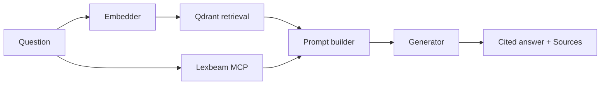

# Architecture

_Last reviewed: 2026-05-09_

This document describes the current state of the EU AI Act RAG demo and the trajectory for evolving it into a production-grade compliance assistant for pharmaceutical use. The applicable regulatory frameworks (HIPAA, GDPR, EU AI Act, GxP / 21 CFR Part 11, EU GMP Annex 22) shape specific architectural choices, called out where they apply.

## 1. Current state

Single Streamlit Python process. UI, embedder, retrieval client, MCP client, and generator client share one address space.

**Per-query flow.** Question → embed → Qdrant top-5 → confidence check (`LOW_CONFIDENCE_THRESHOLD = 0.55`, `src/config.py:22`) → lexbeam MCP call (`src/lex_client.py:56`) → prompt assembly → generator → answer + Sources panel.

**Storage.** Qdrant in embedded mode, file-backed in `qdrant_data/`, one collection per embedder. Source corpus at `data/ai_act.html`. Chat history is in-memory `st.session_state` only.

**Module map.**

| File | Role |
|------|------|
| `app.py` | Streamlit UI, orchestration |
| `src/config.py` | Paths, keys, defaults |
| `src/parse.py` | EUR-Lex HTML → `Chunk[]` |
| `src/ingest.py` | Parse → embed → upsert |
| `src/embedders.py` | Embedder registry |
| `src/retrieve.py` | Query → ranked chunks |
| `src/lex_client.py` | Lexbeam MCP wrapper |
| `src/generators.py` | Generator registry |
| `src/prompts.py` | System + user prompt builder |

Total: ~876 LOC including UI.

## 2. Constraints

The system must always satisfy the following, regardless of what changes around them.

**Citation contract.** Every factual claim cites an article or annex point (`[Article 9]`, `[Annex III, point 5(a)]`). Enforced in `src/prompts.py`. Removing this breaks the auditability story.

**Off-topic refusal.** Below the confidence threshold, the system refuses rather than generates.

**Informational disclaimer.** Every substantive answer ends with the not-legal-advice statement.

**Audit defensibility.** Any answer must be reproducible against a known corpus version, prompt, and model. Required by 21 CFR Part 11 and EU AI Act Article 12 (logging).

**PHI minimisation.** Patient identifiers must not enter prompts on the default path, even when the deployment is fully local. Required by HIPAA and GDPR.

**Data residency.** On the local-only path, no prompt or retrieved chunk leaves EU infrastructure. Required by GDPR and pharma contractual norms.

| Framework | Drives |
|-----------|--------|
| HIPAA | PHI minimisation, audit trail, BAAs for any processor |
| GDPR | Data minimisation, lawful basis, DPIA, residency |
| EU AI Act | Logging, human oversight, technical documentation, cybersecurity (binding for high-risk Aug 2026) |
| GxP / 21 CFR Part 11 | System validation, electronic-signature controls, immutable audit, change control |
| EU GMP Annex 22 _(draft)_ | Anticipated training-data lineage, model validation, performance monitoring |

## 3. Known limitations

Each is the gap between the current code and a production deployment.

- **Single-tenant by construction.** Qdrant embedded mode holds a file lock; a second concurrent user fails.
- **MCP subprocess per query.** `npx`-spawned per request adds ~800 ms–2 s of avoidable latency.
- **No audit trail.** No durable record of queries, retrieved chunks, or answers. Disqualifying for any regulated workflow.
- **No PHI guardrails.** Prompts pass unmodified to generators.
- **Default generator below pharma-grade.** `gemma2:9b` is a demo convenience; structured extraction and tool-calling in pharma generally need 30B–70B-class models.
- **Single-stage retrieval.** No reranker, no hybrid search; underperforms on exact-reference questions.
- **Single corpus.** Only the AI Act. Real questions span MDR, IVDR, ICH Q9, GMP Annex 11, GAMP 5.
- **No version metadata.** Re-ingestion silently replaces the prior index. No record of which model produced which answer.
- **No identity layer.** No auth, no per-user history, no role-based filtering.

## 4. Deployment topology

"Local" covers a spectrum, decided per environment at deployment time. The choice constrains the generator registry, audit destination, and validation evidence the system must produce.

| Topology | Suitable for | Trade-off |
|----------|--------------|-----------|
| **Fully on-premises** (GPU cluster, A100/H100) | All sensitive workloads, including PHI | Highest capex; full validation borne in-house |
| **Air-gapped** (no internet egress) | Ultra-sensitive R&D, IP-critical research | Highest operational friction; updates lag months |
| **Private cloud VPC** (Azure VNet, AWS PrivateLink, GCP) | Most enterprise pharma workloads | Configuration discipline required; one egress rule defeats it |
| **Managed private with BAA** (Azure OpenAI, Bedrock, Vertex) | Non-PHI workloads, faster to stand up | Trust placed in contract + provider attestation |

The current code supports two implicitly: laptop-as-on-prem (Ollama + embedded Qdrant) and direct cloud APIs. Production deployments need explicit support for fully on-prem (target), private VPC (interim), and managed private (for non-PHI).

## 5. Evolution themes

Four themes, ordered by binding constraint. A theme isn't worth starting until the ones above it are in place.

### Process

Move stateful services out of the request handler. Qdrant becomes a long-lived server (single Docker container handles thousands of QPS). The lexbeam MCP runs as a persistent process with a shared session, eliminating the per-query subprocess cost. The Streamlit app becomes a thin orchestrator holding connection pools as module-level singletons. This unblocks every other theme.

### Governance

The set of controls that turn the tool into something a regulated organisation can operate.

- **Audit trail** as part of the request path. Each record contains user identity, question, retrieved chunk IDs and scores, structured-lookup output, full prompts, generator and model identifier, model and index version, generated answer, latency, any policy decision (cloud denied, fallback invoked). Append-only, tamper-evident, shipped to retention-managed storage.
- **PHI guardrails** at the boundary. Input scrubbing (NER-based detection of patient identifiers, pseudonymisation when reference is needed), output redaction (block any identifier not in the scrubbed input), retrieval-time access control (chunks tagged with sensitivity, user role determines accessible classifications).
- **Identity** via OIDC / SAML at the edge. Audit gains real user attribution; role drives default corpus mix and accessible sensitivity classifications.
- **Corpus versioning.** Every ingestion produces a versioned index; old versions retained per retention policy. The audit log records which version answered each query. Plural corpora (each framework as its own Qdrant collection, with one parser per framework under `src/parsers/`) follows naturally — a routing layer decides which collections a question hits.

### Retrieval quality

Layered: dense top-20–50 → cross-encoder reranker (e.g. `BAAI/bge-reranker-v2-m3`) → reranker-derived confidence. Hybrid search via Qdrant sparse vectors, fused by RRF, comes after the reranker is in. The chunking strategy and citation contract do not change.

### Deployment posture

The surface where the system meets the operating environment.

- **Generator strategy.** Production default moves to a 30B–70B model (Llama 3.1 70B, Qwen 2.5 72B, Mistral Large) on the on-prem GPU. Cheap classifier routes to the large model only when needed. Fallback chains capture substitutions in the audit log. The application no longer picks a generator — a policy module picks one given role, data classification, question type, residency.
- **MCP catalogue.** Each maintained framework MCP becomes a deterministic tool the orchestrator selects per query. MCPs carry trust classifications (internal, vendor-attested, community); policy decides which are acceptable per workload.
- **Infrastructure controls.** Network segmentation (inference servers on isolated VLANs, explicit egress allow-list), encryption (AES-256 at rest, TLS 1.3 in transit, optional confidential computing for model weights), backup and DR aligned to the criticality of supported workflows.

## 6. Open questions

Genuinely undecided. Each will become an ADR when resolved.

- **Audit log destination.** SIEM ingestion vs. immutable object storage vs. dedicated audit service depends on the deploying organisation's existing log infrastructure.
- **Corpus version surfacing.** Per-citation (`[Article 9 v2024-07]`) vs. response-footer vs. a hybrid.
- **Policy layer data model.** Named policy set vs. rule engine.
- **MCP supply-chain governance.** Process for vetting an externally-authored MCP before it influences regulated answers.
- **Cross-framework conflict.** When AI Act and ICH Q9 give differently-worded requirements for the same scenario — surface both, pick one, or refuse to choose.
- **GMP Annex 22 readiness.** Architecture review against the final text once published.
- **PHI redaction model.** Off-the-shelf NER (Presidio, scispaCy) vs. domain-tuned, balancing recall against operational complexity.

ADRs will live in `docs/adr/` when written.

## 7. Not building yet

- FastAPI / React rewrite — Streamlit + auth is sufficient at expected user count
- Vector DB cluster — single Qdrant instance handles thousands of QPS
- Replacing Ollama on the local path — kept as the offline-capable option
- Caching — generation is the dominant cost; measure before adding
- Reranker — worth doing once Process and Governance themes are in place
- Streaming — UX win, add when latency is the visible bottleneck
